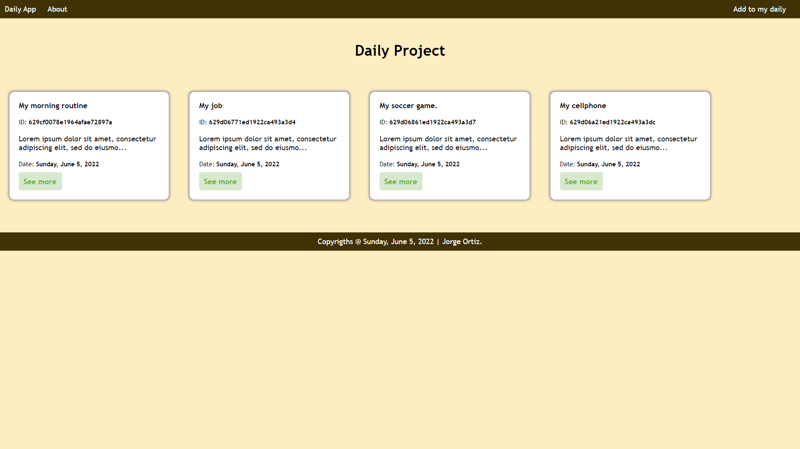
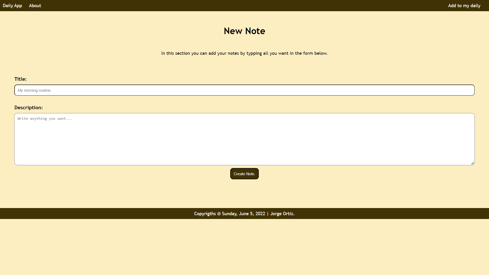
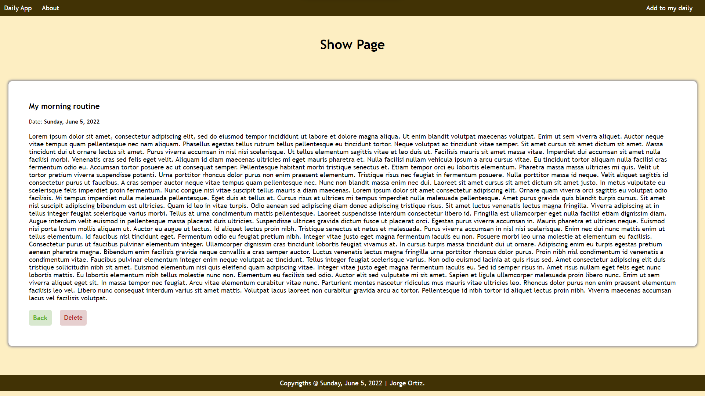

# Daily App.

The **Daily App** was built using EJS, Node and Express JS. 
This web application you can find it in the Heroku servers
by visiting the next link:

* Daily App URL: https://daily-yorch.herokuapp.com/

## Softwares and versions.

* Node JS 14.10.0
* MongoDB Shell v3.6.0
* Visual Studio Code.

## Node packages.

If you want to run this web application in local, you should run and install this packages.

1. Initialize NPM: npm init.
2. Install Express JS: npm install ejs.
3. Install Body-Parser: npm install body-parser.
4. Install Nodemon: npm install nodemon.
5. Install Mongoose: npm install mongoose.

## Web application.

In the section below, you can find images about this web aaplication in production.

.

.

.

## Author

* Jorge Ortiz
* jorge.ortiz@icalialabs.com
* Software engineer.
* San Luis Potosí, S.L.P. México.
